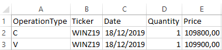
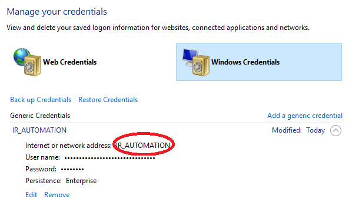

# IRBolsa Automation

> Robotic Process Automation (RPA) Robot developed using UiPath, to automate the register of stock exchange operations in an IR tax calculation tool, especifically https://www.bussoladoinvestidor.com

- Developed using UiPath Studio 2019.4.4

## Setup

### Clone

- Clone this repo to your local machine using `https://github.com/renatomoselli/IRBolsa-automation.git`

### Input File
- There is an "Orders File Example.xlsx" on project root folder, to show how the operations should be input in excel the file.

- The robot will read the files located on "\Queue\To Process" directory, and after conclusion, move them to "\Queue\Processed" directory.

### IR Tool Authentication
- The authentication should be configured on Windows Credential Manager

- And on the config.json file
> { "BussolaCredentialName": "IR_AUTOMATION" }

## Support

Reach out to me at one of the following places!

- LinkedIn Profile <a href="https://www.linkedin.com/in/renatomoselli/" >https://www.linkedin.com/in/renatomoselli/</a>
- E-mail renatomoselli@gmail.com